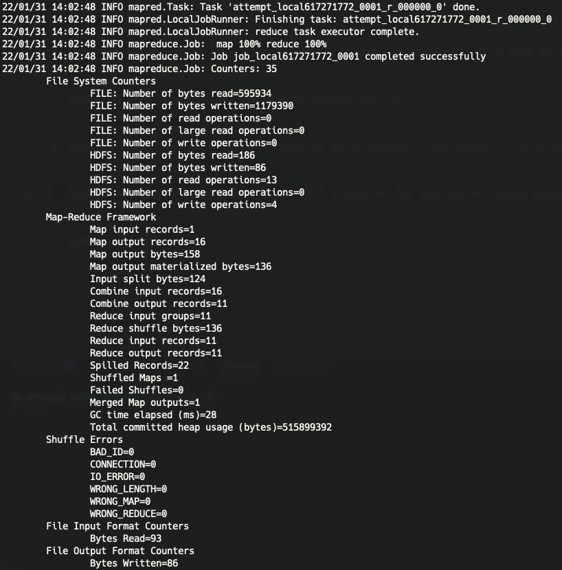
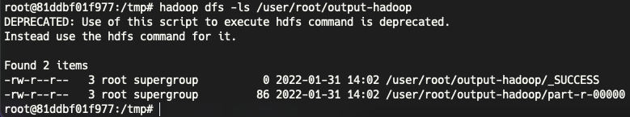
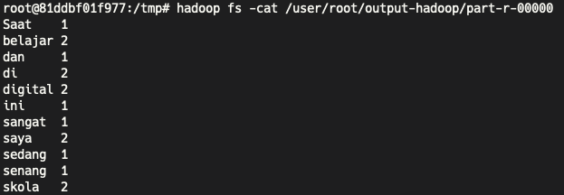

## Homework - Hadoop Fundamental and Operations: 

Menggunakan `WordCounter.java`

`Saat ini saya sedang belajar di digital skola dan saya sangat senang belajar di digital skola`

Di dalam folder `1-intro-hadoop-operation` terdapat file `sample-text.txt`.

### Langkah-langkah

1. Copy dan paste file `hadoop-mapreduce-examples-2.7.1-sources.jar` dan `sampe-text.txt` ke namenode `tmp`
   
   ```bash
   # masuk ke local folder
   cd 1-intro-hadoop-operation
   
   # copy file jar dan masukkan ke dalam container di folder tmp
   docker cp hadoop-mapreduce-examples-2.7.1-sources.jar namenode:/tmp/ 
   # copy juga file txt
   docker cp sample-text.txt namenode:/tmp/
   ```

2. Buka container namenode dan cek apakah file tersebut sudah ada di dalam container dengan command berikut
   
   ```bash
   # masuk ke dalam container
   docker exec -it namenode /bin/bash

   # masuk ke dalam folder tmp 
   cd tmp
   # cek isi dalam folder tmp
   ls
   ```

3. File-file tersebut masih ada di dalam container tapi belum di dalam HDFS System. Untuk itu, kita harus membuat folder `input-hadoop` di dalam `/user/root/`
   
   ```bash
   hdfs dfs -mkdir -p /user/root/input-hadoop
   ``` 

4. Selanjutnya, kita copy file `sample-text.txt` dari local docker ke dalam HDFS System
   
   ```bash
   # arahkan ke folder tmp
   cd tmp

   # copy file ke directory tujuan
   hdfs dfs -put sample-text.txt /user/root/input-hadoop
   ```

5. Untuk mengecek apakah yang kita copy file tersebut sudah benar, kita bisa melakukan pengecekan dengan membaca file tesebut
   
   ```bash
   hdfs dfs -cat /user/root/input-hadoop/sample-text.txt
   ```

6. Setelah dipastikan file sudah di-copy ke dalam folder `input-hadoop`, selanjutnya kita jalankan fungsi Hadoop
   
   ```bash
   hadoop jar hadoop-mapreduce-examples-2.7.1-sources.jar org.apache.hadoop.examples.WordCount input-hadoop output-hadoop
   ```
   
   Setelah berjalan lancar, akan muncul tampilan berikut.
   

7. Apa yang ada di dalam folder `output-hadoop` dapat kita lihat dengan command berikut.
   
   ```bash
   hadoop dfs -ls /user/root/ouput-hadoop
   ```

   

8. Apa yang ada di dalam file `part-r-00000`
   
   ```bash
   hadoop fs -cat /user/root/output-hadoop/part-r-00000
   ```

   

9.  Selesai!