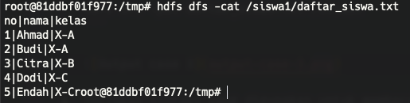

## Homework - Deep Dive Hadoop: HDFS Command

1. Tuliskan sintaks yang digunakan untuk menampilkan semua file yang ada di hdfs secara rekursif
   
   ```bash
   hdfs dfs -lsr /
   ```
   
   

2. Tuliskan Sintaks apa yang digunakan jika saya ingin membuat sebuah folder dengan nama `siswa1` di Hadoop
   
   ```bash
   hdfs dfs -mkdir /siswa1
   ```

   

3. Tuliskan Sintaks yang digunakan untuk copy file dari local ke Hadoop
   
   ```bash
   # masuk ke folder 2-hdfs-command
   cd 2-hdfs-command

   # copy file daftar_siswa.txt dari local ke docker container
   docker cp daftar_siswa.txt namenode:/tmp/

   # masuk ke dalam container
   docker exec -it namenode /bin/bash
   # masuk ke folder tmp
   cd tmp
   # cek apakah file daftar_siswa.txt sudah ada di dalam container
   ls
   # copy kembali dari local container ke HDFS system
   hdfs dfs -put daftar_siswa.txt /siswa1
   ```

   

4. Tuliskan sintaks yang digunakan untuk membaca file yang ada di Hadoop
   
   ```bash
   hdfs dfs -cat /siswa1/daftar_siswa.txt
   ``` 

   