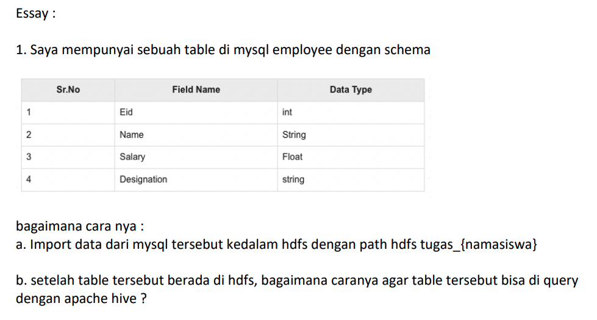

## Homework - Deep Dive Hadoop: Introduction to Sqoop & Hive

Study Case



Bagaimana caranya:
* import data dari mysql tersebut ke dalam HDFS dengan path hdfs `tugas_{namasiswa}`

### Langkah-langkah
1. Masuk ke dalam mysql di local komputer dengan perintah `mysql -uroot -p` kemudian masukkan password yang telah dibuat atau tekan Enter jika tidak ada password.
2. Buat database baru, misalkan `hive_sqoop_demo` dengan perintah `create database hive_sqoop_demo;`.
3. Gunakan database tersebut sebagai default dengan perintah `use hive_sqoop_demo;`.
4. Buat tabel baru `employee`:
   
   ```sql
   create table employee(eid int primary key, name varchar(50), salary float, designation varchar(100));
   ```

5. Insert beberapa data pada tabel tersebut.
   
   ```sql
   insert into employee values (1, 'Eko', 3500750.50, 'Main salary');
   insert into employee values (2, 'Teguh', 4850000.25, 'Bonus');
   insert into employee values (3, 'Widodo', 675000.00, 'Trip bonus');
   ```

6. Tampilkan isian data pada tabel tersebut.
   
   ```sql
   select * from employee;
   ```

   

7. Import dari MySQL ke HDFS
   
   ```bash
   ./bin/sqoop import \
   --connect "jdbc:mysql://localhost:3306/hive_sqoop_demo" \
   --username root \
   --password password \
   --table employee \
   --target-dir="belajar_hive_sqoop" -m 3

   ```

* setelah table tersebut berada di HDFS, bagaimana caranya agar table tersebut bisa diquery dengan apache Hive?

    Kita bisa sekaligus import SQL dari MySQL langsung ke Hive dengan command berikut.

    ```bash
    ./bin/sqoop import "-Dorg.apache.sqoop.splitter.allow_text_splitter=true" \
    --connect "jdbc:mysql://localhost:3306/hive_sqoop_demo" \
    --username root \
    --password password \
    --table employee \
    --target-dir "belajar_hive_sqoop" \
    --hive-import \
    --create-hive-table \
    --hive-table default.belajar_hive_sqoop -m 3
    ```

    Dengan begitu, apabila berhasil, kita bisa membuka CLI Hive dan melakukan query.