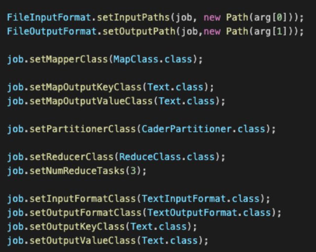

## Homework - Deep Dive Hadoop: MapReduce Configuration

Dari konfigurasi berikut,

Identifikasi (lihat gambar):

1. Input Type Format: `TextInputFormat`

2. Output Type Format: `TextOutputFormat`

3. Jumlah Reducer: `3`