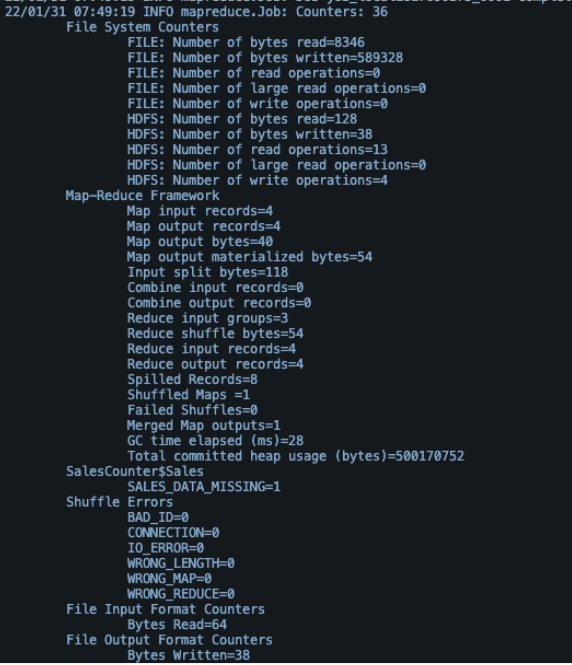

## Homework - Deep Dive Hadoop: MapReduce Counters

**Soal Essay**

1. Dari hasil log di bawah ini, mana yang merupakan `User Defined Counter` dana mana yang merupakan `Built in Counter`?
   
   

   **User Defined Counter** --> *SalesCounter*

   **Built in Counter** --> *File System Counters*, *File Input Format Counters*, *File Output Format Counters*

2. Dari source code berikut ini, identifikasi:
   
    ```java
    enum Sales {
        SALES_DATA_MISSING
    }

    // Mapper
    public static class SalesMapper extends Mapper<LongWritable, Text, Text, IntWritable> {
        private Text item = new Text();
        IntWritable sales = new IntWritable();
        public void map(LongWritable key, Text value, Context context) 
            throws IOExeption, InterruptedException {
                // Spliting the line on tab
                String[] salesArr = value.toString().split("\\|");
                item.set(salesArr[0]);

                if (salesArr[1] != null && !salesArr[1].trim().equals("")) {
                    sales.set(Integer.parseInt(salesArr[1]));
                } else {
                    // incrementing counter
                    context.getCounter(Sales.SALES_DATA_MISSING).increment(1);
                    sales.set(0);
                }
                context.write(item, sales);
            }
    }
    ```

   * Logic dari code mapper;
     
     ```text
     Code mapper di atas digunakan untuk mencari data yang kosong dari suatu subset data. Pada prosesnya, mapper akan membaca inputan dari set data per line, kemudian dalam satu line, akan displit dengan tanda `|` dan disimpan ke dalam `salesArr`. Data index ke-0 dari `salesArr` akan dijadikan sebagai `key`, sedangkan data index ke-1 akan dilakukan pengecekan apakah ada isian atau tidak. 

     Pada baris kode program `if (salesArr[1] != null && !salesArr[1].trim().equals(""))`, akan dicek `salesArr[1]` apakah ada isian (tidak null dan tidak kosong). Apabila ada isian, maka value tersebut akan dimasukkan ke dalam `sales` dan selanjutnya akan dituliskan pada `context.write(item, sales)` yang nantinya akan digunakan di reducer. Apabila `salesArr[1]` tidak ada isian, maka akan dimasukkan ke dalam `enum` yang nantinya akan diprint sebagai alert bahwa ada data missing, `context.getCounter(Sales.SALES_DATA_MISSING).increment(1)` berarti apabila ada missing data, akan bertambah 1. Selanjutnya, `sales` akan diset menjadi 0 pada baris kode `sales.set(0)`.

     Terakhir, baris kode program `context.write(item, sales)` akan menuliskan dalam bentuk <key, value> item dan sales.
     ```

   * Di variabel apa user mendefinisikan counter;
     
     **Sales**

   * Fungsi apa yang digunakan user untuk memanggil fungsi counter? 
     
     **context.getCounter()**
     
     
     

